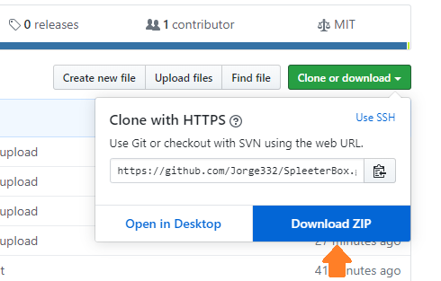
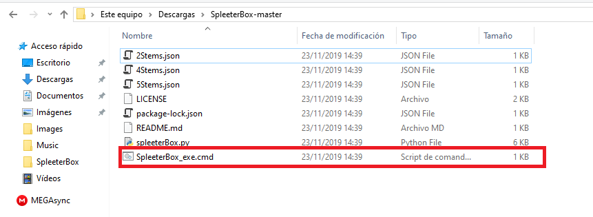
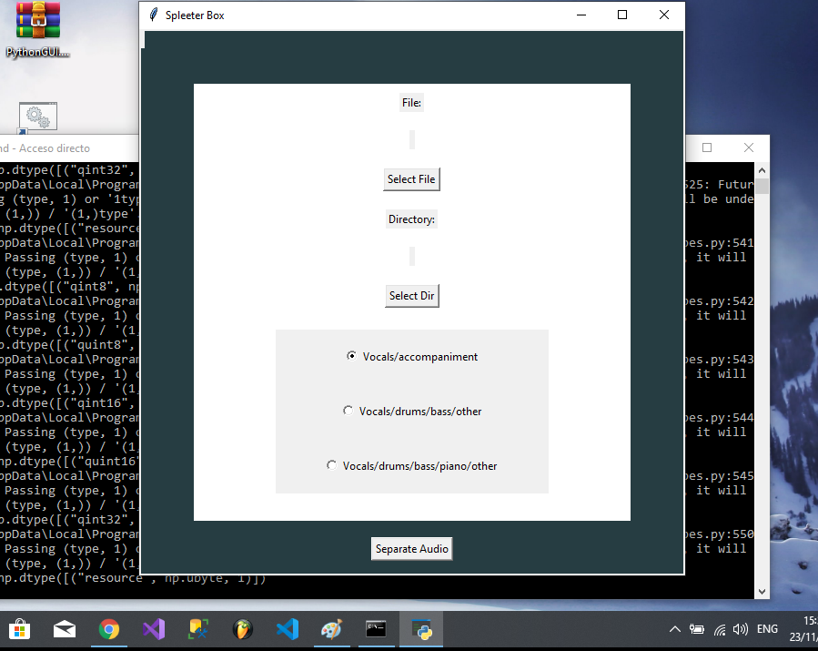
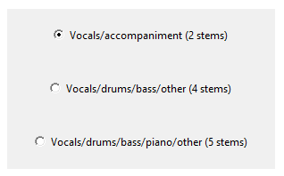
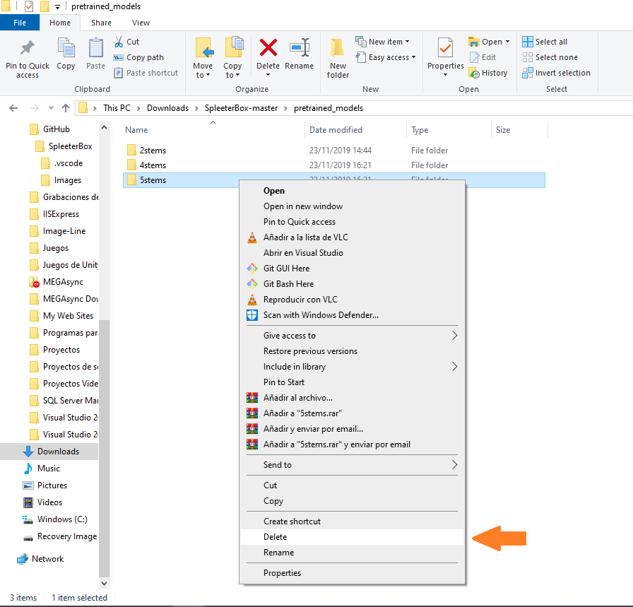

# <b style="color: red; font-size: 100px;">Disclaimer: You need to install everything as explained in Dylan's video and have it working properly to use this Implementation!</b>

# SpleeterBox
<b>SpleeterBox</b> is an implementation of Deezer's Spleeter library, that allows audio separation through the use of Machine Learning, this project is nothing fancy but I hope it helps some people out there. 
 
 

if you have any question you can mail me to: spleeterbox@gmail.com

I created this GUI implementation due to the requests on Dylan Tallchief’s video about the Library, I think this way is better than writing the command using CMD or Powershell every time you want to separate a song.  

<b>This implementation requires:</b>  
Windows 10 64 bits  
Python 3.7.5  
Spleeter Library version 1.4.8  
FFmpeg  
Everything here is explained in Dylan's video &#8593;.
 
 

<b>Relevant Info</b> 
 
 
Dylan's Video: https://www.youtube.com/watch?v=tgnuOSLPwMI

<h2>-->> Donations <<--</h2>

If you guys find it useful you can  
invite me a coffee via paypal here  
<b>Paypal</b>: https://paypal.me/jramirezp332?locale.x=es_XC   
Or via Ko-fi here  
<b>Ko-fi</b>: https://ko-fi.com/jorgeerp332
# First Use
When you first Use the GUI App it will take a while to finish the separation process, this happens since it needs to download the pretrained models from Deezer's sources, then the app creates a folder inside the SpleeterBox folder named pretrained_models and it stores the models there, this process is the same for every new model you use (<b>every separation option</b>), but it happens just the first time you use every option, then when you use that option again it will be a lot faster cause it already saved the models.
 
The duration of the <b>first</b> time you use every model (Separation Option) will depend on your connection speed, past the first time you use a Separation Option you can use it Offline since it already downloaded the pretrained modules.

<b>Pretrained Models Estimated Sizes</b>  
 2 Stems -> 75,7 MB  
 4 Stems -> 151 MB  
 5 Stems -> 189 MB  

# Usage
The usage is very simple, first you just need to make sure you had installed and tested python and spleeter <b>(And Everything it needs to work) as explained in Dylan's Video (The one up there &#8593;)</b>, once you have done that you just need to download this project as a .zip
 

Once you have the zip file you just need to extract the folder using Winrar or windows default zip files manager, then you should move the folder to a location like <b>My Documents</b> just to make sure you won't delete it by accident, then when you have the folder with the files in a secure place you just need to go inside it and double click the .cmd file to execute the python app. 
(<b>For an easy use you can just create a shortcut of this file in your Desktop to access it in the future</b>)
 
 

 Then it should open a window like this one

 

It opens a CMD Window as well but you don't have to worry about it, you can just minimize that one and use the GUI window. 

# Interaction

There are 3 buttons you can interact with 
 
1-Select File -> Opens Up a window to navigate the folders in your PC and select the file you want to separate
 
2-Select Dir -> Opens Up a window to navigate the folders in your PC and select the folder you want to save the resulting files
 
3-Separate Audio -> Once you've selected both File and Dir it starts the process of audio separation

<b>Separation Options:</b>

These are the ways you can split the audio, you just need to select the one you desire and then click on the Separete Audio button start the process
 

# Upadting Pretrained Models
<b>Deezer</b> will probably update their pretrained models in the future so in order to update the ones inside the App you just need to go inside the SpleeterBox folder(where ever you put it) and then go inside the pretrained_models folder and delete the one you desire to update, and then the next time you use that option it will download the latest model from Deezer's Sources
 

# Final thoughts
Well building this implementation took a fair amount of time and effort, It was quite fun to learn some Python along the way and it expanded my horizons too, I hope at least some people find this useful.     
<b>Jorge E. Ramirez Porras. aka Jaime Rojas</b>
  
For more information on the spleeter project please visit https://github.com/deezer/spleeter
